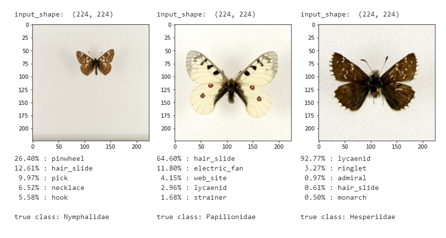
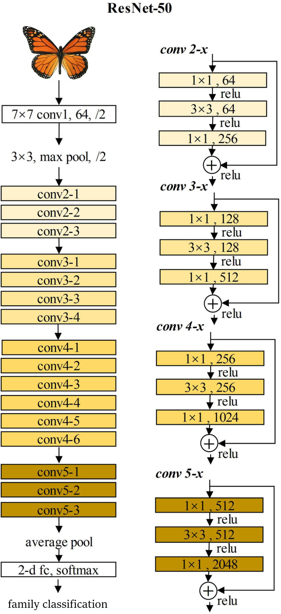

This repository is just to show and teach some Convolutional Neural Network and Transfer Learning methods used to solve Image Classification problems.

# Butterfly classification (CNN - Transfer Learning)

  
In this repository, and based in a huge butterfly [image classified databased](https://www.research-collection.ethz.ch/handle/20.500.11850/365379), I train a model to do this classification in a autonomous way with the best possible accuracy. To achieve this, I use the help of the Pre-Trained Model-ResNet-50, it's basically a convolutional neural network, 50 layers deep, that has been trained on more than a million images from the ImageNet database. Because this is not enough o ge my specific classification, I add some layers on top of this model, to be able to trin it and get an excellent classification result.

Techniques applied:
- Data Generation
  - Data Sampling
  - Data Agumentation
- Defining class weights
- Create Model instance
- Unlocking Pre-Trained Model-ResNet-50 layers for training
- Model evaluation

---
### Methodology

  - **Data Understanding:** 
    - Because we actually have a clean and structured dataset, this step is just based in loading correctly all the data and geting the information we are interested in.

  - **Data Generation**
    - In this section, we will generate our data for training and testing.
    - Data Sampling, we undersample the image dataset, and also apply class weights to the trainning model because our target variable is imbalance.
 
        As you all know, imbalanced datasets can cause a problem during training because the neural network will be shown many more examples high frequent class, so it might             become better at recognizing only that class. A scikit-learn tool "Class weights" helps as to solve this problem calculating weights that will properly balance any               dataset. These weights are applied to the gradient for each image in the batch during training, so as to scale their influence on the overall gradient for the batch.

    - Data Augmentation, it's key to the training of neural networks for image classification. 

        Training CNN's for accurate predictions requires a lot of image data. Usually there is never enough images to cope with all of the variability that the classifier might encounter while also preventing overfitting.

        The smart solution to this is to randomly augment, or edit, the images just before they are passed to the network for training. This allows us to create a theoretically infinite amount of images and also generalise the model's behaviour.

<image src="Notebooks/images/butterfly augmentation.png" width=800px/>

  - **Create Model instance:**
 
